ggplot 1
================

Load in a dataset that we’ll use often.

You can also set custom sizes:

``` r
library(tidyverse)
```

    ## ── Attaching packages ─────────────────────────────────────── tidyverse 1.3.1 ──

    ## ✓ ggplot2 3.3.5     ✓ purrr   0.3.4
    ## ✓ tibble  3.1.4     ✓ dplyr   1.0.7
    ## ✓ tidyr   1.1.3     ✓ stringr 1.4.0
    ## ✓ readr   2.0.1     ✓ forcats 0.5.1

    ## ── Conflicts ────────────────────────────────────────── tidyverse_conflicts() ──
    ## x dplyr::filter() masks stats::filter()
    ## x dplyr::lag()    masks stats::lag()

``` r
library(ggridges)

knitr::opts_chunk$set(
  fig_width = 6,
  fig.asp = .6,
  out_width = "90%"
)
```

``` r
weather_df = 
  rnoaa::meteo_pull_monitors(
    c("USW00094728", "USC00519397", "USS0023B17S"),
    var = c("PRCP", "TMIN", "TMAX"), 
    date_min = "2017-01-01",
    date_max = "2017-12-31") %>%
  mutate(
    name = recode(
      id, 
      USW00094728 = "CentralPark_NY", 
      USC00519397 = "Waikiki_HA",
      USS0023B17S = "Waterhole_WA"),
    tmin = tmin / 10,
    tmax = tmax / 10) %>%
  select(name, id, everything())
```

    ## Registered S3 method overwritten by 'hoardr':
    ##   method           from
    ##   print.cache_info httr

    ## using cached file: ~/Library/Caches/R/noaa_ghcnd/USW00094728.dly

    ## date created (size, mb): 2021-10-05 10:31:06 (7.602)

    ## file min/max dates: 1869-01-01 / 2021-10-31

    ## using cached file: ~/Library/Caches/R/noaa_ghcnd/USC00519397.dly

    ## date created (size, mb): 2021-10-05 10:31:12 (1.697)

    ## file min/max dates: 1965-01-01 / 2020-02-29

    ## using cached file: ~/Library/Caches/R/noaa_ghcnd/USS0023B17S.dly

    ## date created (size, mb): 2021-10-05 10:31:14 (0.912)

    ## file min/max dates: 1999-09-01 / 2021-09-30

``` r
## Registered S3 method overwritten by 'hoardr':
##   method           from
##   print.cache_info httr
## using cached file: /Users/jeffgoldsmith/Library/Caches/R/noaa_ghcnd/USW00094728.dly
## date created (size, mb): 2020-09-25 14:56:47 (7.519)
## file min/max dates: 1869-01-01 / 2020-09-30
## using cached file: /Users/jeffgoldsmith/Library/Caches/R/noaa_ghcnd/USC00519397.dly
## date created (size, mb): 2020-09-25 14:56:52 (1.699)
## file min/max dates: 1965-01-01 / 2020-03-31
## using cached file: /Users/jeffgoldsmith/Library/Caches/R/noaa_ghcnd/USS0023B17S.dly
## date created (size, mb): 2020-09-25 14:56:54 (0.877)
## file min/max dates: 1999-09-01 / 2020-09-30

weather_df
```

    ## # A tibble: 1,095 × 6
    ##    name           id          date        prcp  tmax  tmin
    ##    <chr>          <chr>       <date>     <dbl> <dbl> <dbl>
    ##  1 CentralPark_NY USW00094728 2017-01-01     0   8.9   4.4
    ##  2 CentralPark_NY USW00094728 2017-01-02    53   5     2.8
    ##  3 CentralPark_NY USW00094728 2017-01-03   147   6.1   3.9
    ##  4 CentralPark_NY USW00094728 2017-01-04     0  11.1   1.1
    ##  5 CentralPark_NY USW00094728 2017-01-05     0   1.1  -2.7
    ##  6 CentralPark_NY USW00094728 2017-01-06    13   0.6  -3.8
    ##  7 CentralPark_NY USW00094728 2017-01-07    81  -3.2  -6.6
    ##  8 CentralPark_NY USW00094728 2017-01-08     0  -3.8  -8.8
    ##  9 CentralPark_NY USW00094728 2017-01-09     0  -4.9  -9.9
    ## 10 CentralPark_NY USW00094728 2017-01-10     0   7.8  -6  
    ## # … with 1,085 more rows

``` r
## # A tibble: 1,095 x 6
##    name           id          date        prcp  tmax  tmin
##    <chr>          <chr>       <date>     <dbl> <dbl> <dbl>
##  1 CentralPark_NY USW00094728 2017-01-01     0   8.9   4.4
##  2 CentralPark_NY USW00094728 2017-01-02    53   5     2.8
##  3 CentralPark_NY USW00094728 2017-01-03   147   6.1   3.9
##  4 CentralPark_NY USW00094728 2017-01-04     0  11.1   1.1
##  5 CentralPark_NY USW00094728 2017-01-05     0   1.1  -2.7
##  6 CentralPark_NY USW00094728 2017-01-06    13   0.6  -3.8
##  7 CentralPark_NY USW00094728 2017-01-07    81  -3.2  -6.6
##  8 CentralPark_NY USW00094728 2017-01-08     0  -3.8  -8.8
##  9 CentralPark_NY USW00094728 2017-01-09     0  -4.9  -9.9
## 10 CentralPark_NY USW00094728 2017-01-10     0   7.8  -6  
## # … with 1,085 more rows
```

## Scatterplot

tmax vs tmin

``` r
weather_df %>%
  ggplot(aes(x = tmin, y = tmax))
```

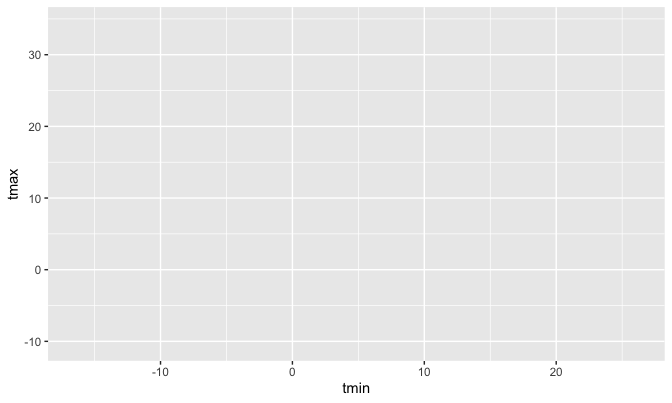<!-- -->

This does the same thing pretty much:

``` r
weather_df %>%
  ggplot(aes(x = tmin, y = tmax)) + 
  geom_point()
```

    ## Warning: Removed 15 rows containing missing values (geom_point).

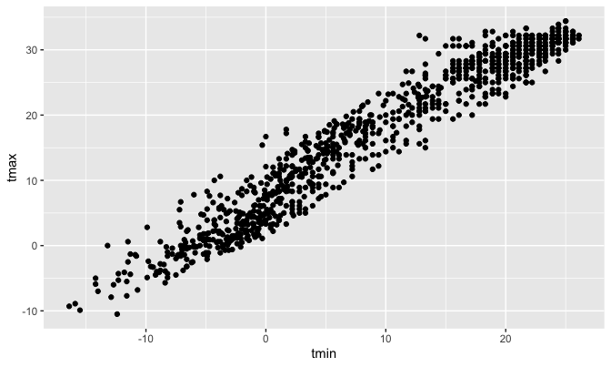<!-- -->

\#\#Let’s fancy it up

Add color? lines? more?

``` r
ggplot(weather_df, aes(x = tmin, y = tmax)) + 
  geom_point(aes(color = name))
```

    ## Warning: Removed 15 rows containing missing values (geom_point).

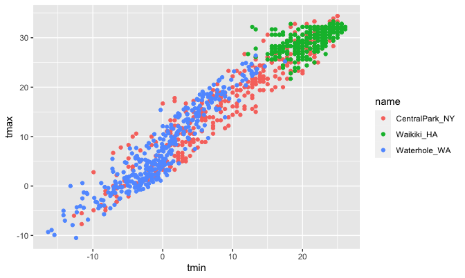<!-- -->

``` r
## Warning: Removed 15 rows containing missing values (geom_point).
```

Adding smooth curve, making dat points more transparent.

``` r
ggplot(weather_df, aes(x = tmin, y = tmax, color = name)) + 
  geom_point(alpha = .5) +
  geom_smooth(se = FALSE)
```

    ## `geom_smooth()` using method = 'loess' and formula 'y ~ x'

    ## Warning: Removed 15 rows containing non-finite values (stat_smooth).

    ## Warning: Removed 15 rows containing missing values (geom_point).

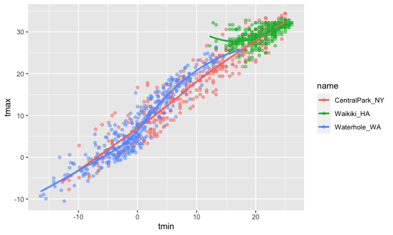<!-- -->

``` r
## `geom_smooth()` using method = 'gam' and formula 'y ~ s(x, bs = "cs")'
## Warning: Removed 15 rows containing non-finite values (stat_smooth).
## Warning: Removed 15 rows containing missing values (geom_point).
```

Another way to look at it:

``` r
ggplot(weather_df, aes(x = tmin, y = tmax, color = name)) + 
  geom_point(alpha = .5) +
  geom_smooth(se = FALSE) + 
  facet_grid(. ~ name)
```

    ## `geom_smooth()` using method = 'loess' and formula 'y ~ x'

    ## Warning: Removed 15 rows containing non-finite values (stat_smooth).

    ## Warning: Removed 15 rows containing missing values (geom_point).

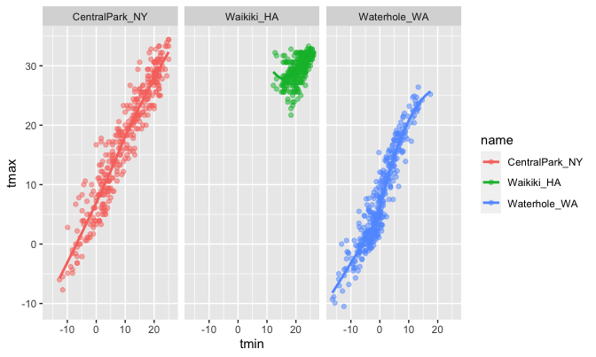<!-- -->

One more scatterplot.

``` r
ggplot(weather_df, aes(x = date, y = tmax, color = name)) + 
  geom_point(aes(size = prcp), alpha = .5) +
  geom_smooth(se = FALSE) + 
  facet_grid(. ~ name)
```

    ## `geom_smooth()` using method = 'loess' and formula 'y ~ x'

    ## Warning: Removed 3 rows containing non-finite values (stat_smooth).

    ## Warning: Removed 3 rows containing missing values (geom_point).

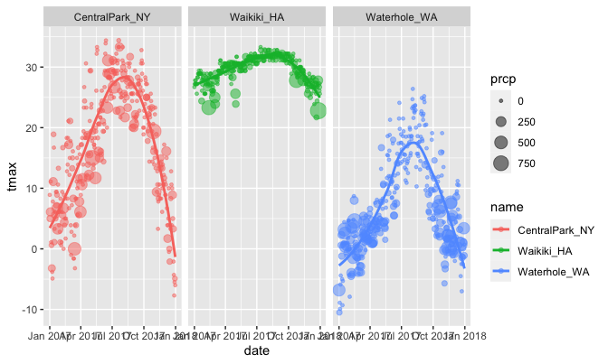<!-- -->

## Let’s use data manipulation as a part of this

``` r
weather_df %>%
  filter(name == "CentralPark_NY") %>%
  mutate(
    tmax = tmax * (9/5) + 32,
    tmin = tmin * (9/5) + 32
  ) %>%
  ggplot(aes (x = tmin, y = tmax)) + 
  geom_point()
```

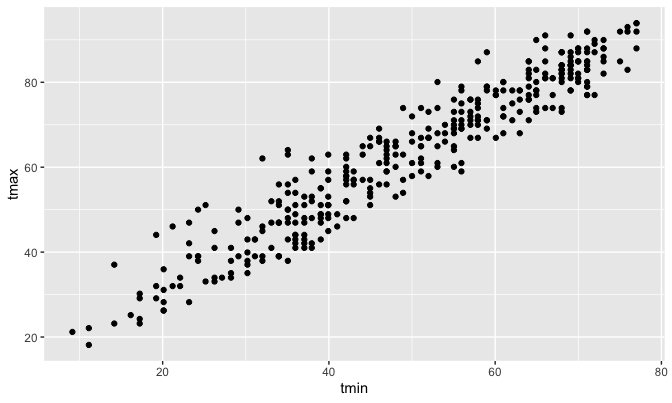<!-- -->

## Stacking geoms

Which geoms do you want?

``` r
weather_df %>%
    ggplot(aes(x = date, y = tmax, color = name)) + geom_smooth()
```

    ## `geom_smooth()` using method = 'loess' and formula 'y ~ x'

    ## Warning: Removed 3 rows containing non-finite values (stat_smooth).

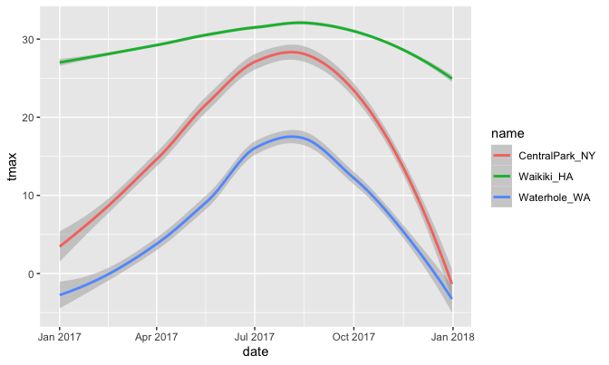<!-- -->

This next one is like a 2D heat map:

``` r
weather_df %>%
  ggplot(aes(x = tmin, y = tmax)) + geom_bin2d()
```

    ## Warning: Removed 15 rows containing non-finite values (stat_bin2d).

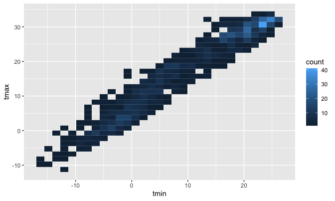<!-- -->

## Univariate plots

``` r
weather_df %>%
  ggplot(aes(x = tmax)) +
  geom_histogram()
```

    ## `stat_bin()` using `bins = 30`. Pick better value with `binwidth`.

    ## Warning: Removed 3 rows containing non-finite values (stat_bin).

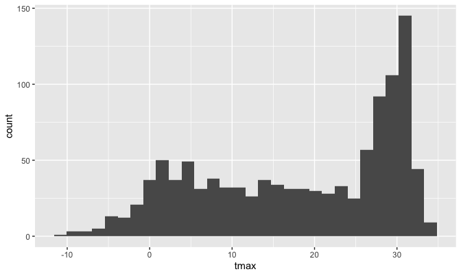<!-- -->

After ggplot you use a +, before it you use a pipe.

With color, which isn’t great but you can add the `facet_grid` to split
them:

``` r
weather_df %>%
  ggplot(aes(x = tmax, fill = name)) +
  geom_histogram() +
  facet_grid(. ~ name)
```

    ## `stat_bin()` using `bins = 30`. Pick better value with `binwidth`.

    ## Warning: Removed 3 rows containing non-finite values (stat_bin).

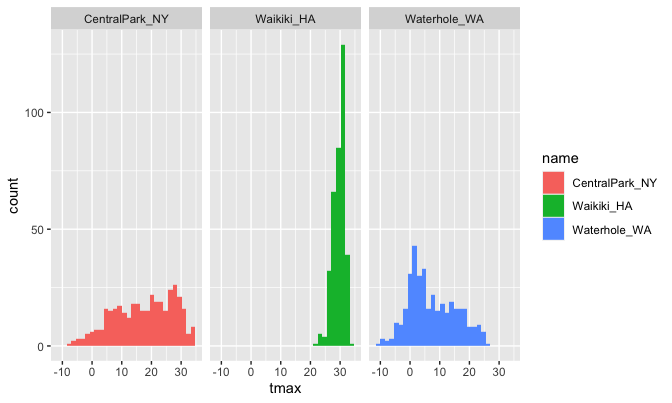<!-- -->

Some other plots…

``` r
weather_df %>%
  ggplot(aes(x = tmax, fill = name)) +
  geom_density(alpha = 0.3)
```

    ## Warning: Removed 3 rows containing non-finite values (stat_density).

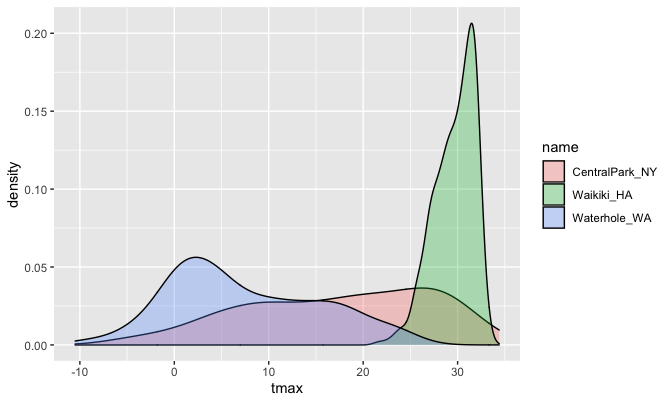<!-- -->

Still with `tmax` and `name`

Boxplot

``` r
weather_df %>%
  ggplot(aes(x = name, y = tmax)) + 
  geom_boxplot()
```

    ## Warning: Removed 3 rows containing non-finite values (stat_boxplot).

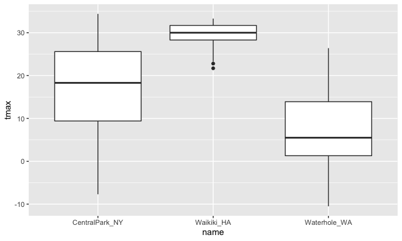<!-- -->

Some poeple like violin plots??

``` r
weather_df %>%
  ggplot(aes(x = name, y = tmax)) + 
  geom_violin()
```

    ## Warning: Removed 3 rows containing non-finite values (stat_ydensity).

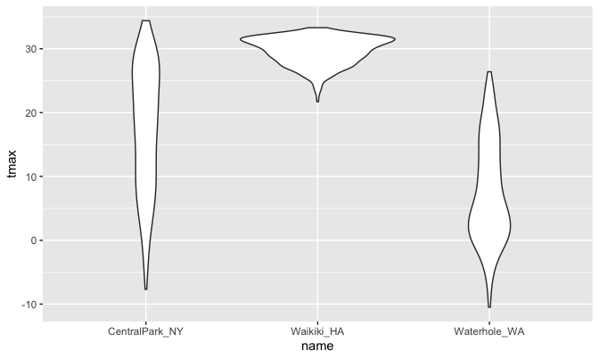<!-- -->

What about ridge plots? This is what the ridges library is for. You can
customize alpha and scale or just not include them here.

``` r
weather_df %>%
  ggplot(aes(x = tmax, y = name)) +
  geom_density_ridges(alpha = 0.8, scale = 0.8)
```

    ## Picking joint bandwidth of 1.84

    ## Warning: Removed 3 rows containing non-finite values (stat_density_ridges).

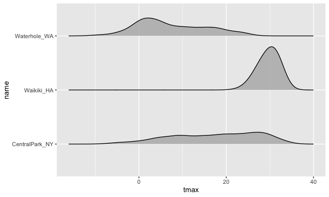<!-- -->

## Embedding plots

``` r
weather_df %>%
  ggplot(aes(x = tmin, y = tmax, color = name)) +
  geom_point(alpha = 0.3)
```

    ## Warning: Removed 15 rows containing missing values (geom_point).

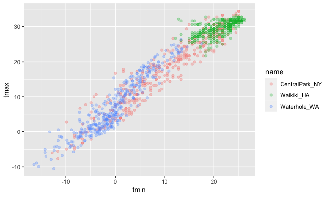<!-- -->

``` r
weather_df %>%
  ggplot(aes(x = tmin, y = tmax, color = name)) +
  geom_point(alpha = 0.3)
```

    ## Warning: Removed 15 rows containing missing values (geom_point).

<!-- -->
