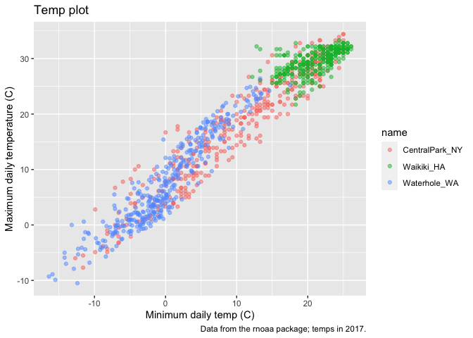
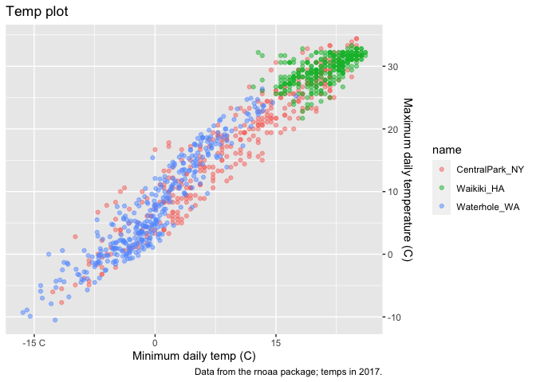
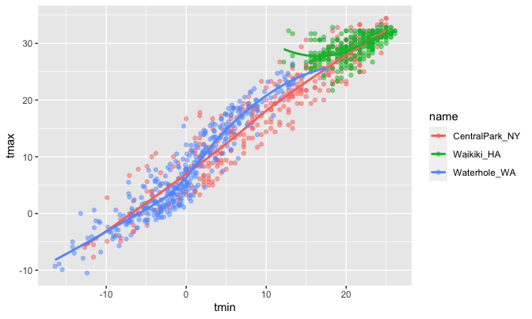
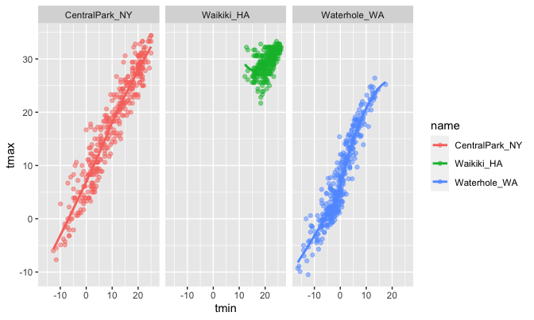
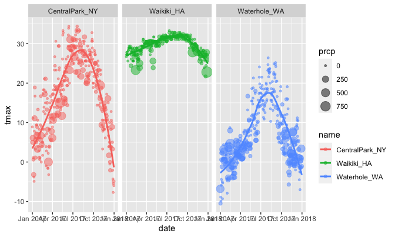
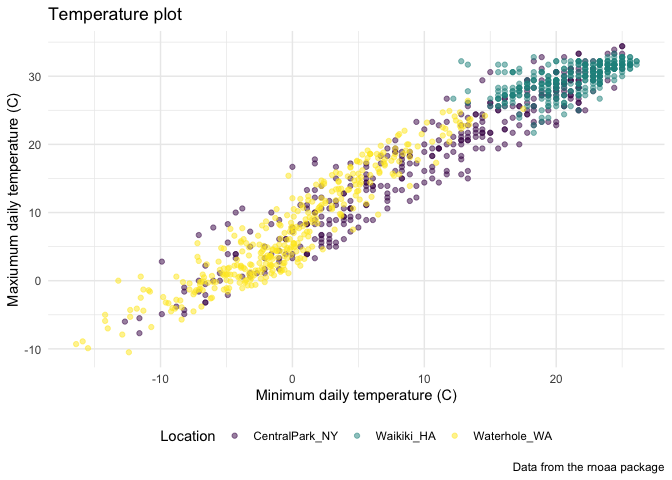
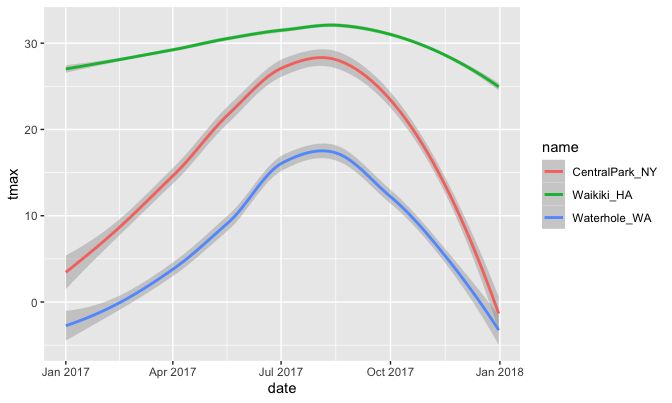
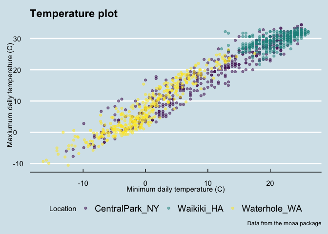
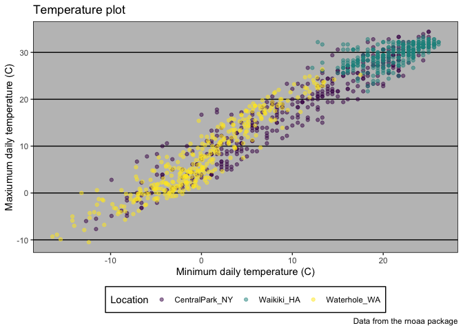
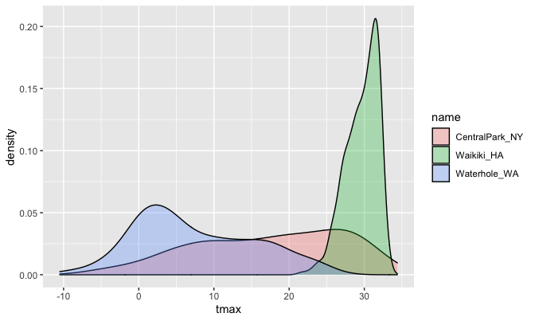

ggplot 1
================

Load in a dataset that we’ll use often.

You can also set custom sizes:

``` r
library(tidyverse)
```

    ## ── Attaching packages ─────────────────────────────────────── tidyverse 1.3.1 ──

    ## ✓ ggplot2 3.3.5     ✓ purrr   0.3.4
    ## ✓ tibble  3.1.4     ✓ dplyr   1.0.7
    ## ✓ tidyr   1.1.3     ✓ stringr 1.4.0
    ## ✓ readr   2.0.1     ✓ forcats 0.5.1

    ## ── Conflicts ────────────────────────────────────────── tidyverse_conflicts() ──
    ## x dplyr::filter() masks stats::filter()
    ## x dplyr::lag()    masks stats::lag()

``` r
library(ggridges)
library(patchwork)
```

``` r
weather_df = 
  rnoaa::meteo_pull_monitors(
    c("USW00094728", "USC00519397", "USS0023B17S"),
    var = c("PRCP", "TMIN", "TMAX"), 
    date_min = "2017-01-01",
    date_max = "2017-12-31") %>%
  mutate(
    name = recode(
      id, 
      USW00094728 = "CentralPark_NY", 
      USC00519397 = "Waikiki_HA",
      USS0023B17S = "Waterhole_WA"),
    tmin = tmin / 10,
    tmax = tmax / 10) %>%
  select(name, id, everything())
```

    ## Registered S3 method overwritten by 'hoardr':
    ##   method           from
    ##   print.cache_info httr

    ## using cached file: ~/Library/Caches/R/noaa_ghcnd/USW00094728.dly

    ## date created (size, mb): 2021-10-05 10:31:06 (7.602)

    ## file min/max dates: 1869-01-01 / 2021-10-31

    ## using cached file: ~/Library/Caches/R/noaa_ghcnd/USC00519397.dly

    ## date created (size, mb): 2021-10-05 10:31:12 (1.697)

    ## file min/max dates: 1965-01-01 / 2020-02-29

    ## using cached file: ~/Library/Caches/R/noaa_ghcnd/USS0023B17S.dly

    ## date created (size, mb): 2021-10-05 10:31:14 (0.912)

    ## file min/max dates: 1999-09-01 / 2021-09-30

``` r
## Registered S3 method overwritten by 'hoardr':
##   method           from
##   print.cache_info httr
## using cached file: /Users/jeffgoldsmith/Library/Caches/R/noaa_ghcnd/USW00094728.dly
## date created (size, mb): 2020-09-25 14:56:47 (7.519)
## file min/max dates: 1869-01-01 / 2020-09-30
## using cached file: /Users/jeffgoldsmith/Library/Caches/R/noaa_ghcnd/USC00519397.dly
## date created (size, mb): 2020-09-25 14:56:52 (1.699)
## file min/max dates: 1965-01-01 / 2020-03-31
## using cached file: /Users/jeffgoldsmith/Library/Caches/R/noaa_ghcnd/USS0023B17S.dly
## date created (size, mb): 2020-09-25 14:56:54 (0.877)
## file min/max dates: 1999-09-01 / 2020-09-30

weather_df
```

    ## # A tibble: 1,095 × 6
    ##    name           id          date        prcp  tmax  tmin
    ##    <chr>          <chr>       <date>     <dbl> <dbl> <dbl>
    ##  1 CentralPark_NY USW00094728 2017-01-01     0   8.9   4.4
    ##  2 CentralPark_NY USW00094728 2017-01-02    53   5     2.8
    ##  3 CentralPark_NY USW00094728 2017-01-03   147   6.1   3.9
    ##  4 CentralPark_NY USW00094728 2017-01-04     0  11.1   1.1
    ##  5 CentralPark_NY USW00094728 2017-01-05     0   1.1  -2.7
    ##  6 CentralPark_NY USW00094728 2017-01-06    13   0.6  -3.8
    ##  7 CentralPark_NY USW00094728 2017-01-07    81  -3.2  -6.6
    ##  8 CentralPark_NY USW00094728 2017-01-08     0  -3.8  -8.8
    ##  9 CentralPark_NY USW00094728 2017-01-09     0  -4.9  -9.9
    ## 10 CentralPark_NY USW00094728 2017-01-10     0   7.8  -6  
    ## # … with 1,085 more rows

``` r
## # A tibble: 1,095 x 6
##    name           id          date        prcp  tmax  tmin
##    <chr>          <chr>       <date>     <dbl> <dbl> <dbl>
##  1 CentralPark_NY USW00094728 2017-01-01     0   8.9   4.4
##  2 CentralPark_NY USW00094728 2017-01-02    53   5     2.8
##  3 CentralPark_NY USW00094728 2017-01-03   147   6.1   3.9
##  4 CentralPark_NY USW00094728 2017-01-04     0  11.1   1.1
##  5 CentralPark_NY USW00094728 2017-01-05     0   1.1  -2.7
##  6 CentralPark_NY USW00094728 2017-01-06    13   0.6  -3.8
##  7 CentralPark_NY USW00094728 2017-01-07    81  -3.2  -6.6
##  8 CentralPark_NY USW00094728 2017-01-08     0  -3.8  -8.8
##  9 CentralPark_NY USW00094728 2017-01-09     0  -4.9  -9.9
## 10 CentralPark_NY USW00094728 2017-01-10     0   7.8  -6  
## # … with 1,085 more rows
```

## Remember this plot… ?

``` r
weather_df %>% 
  ggplot(aes(x = tmin, y = tmax)) + 
  geom_point(aes(color = name), alpha = .5)
```

    ## Warning: Removed 15 rows containing missing values (geom_point).

<!-- -->

## With Labels

``` r
weather_df %>% 
  ggplot(aes(x = tmin, y = tmax)) + 
  geom_point(aes(color = name), alpha = .5) +
  labs(
    title = "Temp plot",
    x = "Minimum daily temp (C)",
    y = "Maximum daily temperature (C)",
    caption = "Data from the rnoaa package; temps in 2017."
  )
```

    ## Warning: Removed 15 rows containing missing values (geom_point).

<!-- -->

## Scales

Start with the same plot; x and y scales

``` r
weather_df %>% 
  ggplot(aes(x = tmin, y = tmax)) + 
  geom_point(aes(color = name), alpha = .5) +
  labs(
    title = "Temp plot",
    x = "Minimum daily temp (C)",
    y = "Maximum daily temperature (C)",
    caption = "Data from the rnoaa package; temps in 2017."
  ) +
  scale_x_continuous(
    breaks = c(-15, 0, 15),
    labels = c("-15 C", "0", "15")
  )+
  scale_y_continuous(
    position = "right"
  )
```

    ## Warning: Removed 15 rows containing missing values (geom_point).

<!-- -->

Look at color scales

``` r
weather_df %>% 
  ggplot(aes(x = tmin, y = tmax)) + 
  geom_point(aes(color = name), alpha = .5) +
  labs(
    title = "Temp plot",
    x = "Minimum daily temp (C)",
    y = "Maximum daily temperature (C)",
    caption = "Data from the rnoaa package; temps in 2017."
  ) +
  scale_color_hue(
    name = "Location",
    h = c(100, 300)
  )
```

    ## Warning: Removed 15 rows containing missing values (geom_point).

<!-- -->

\#\#\#Virdis

``` r
ggp_temp_plot = 
  weather_df %>% 
  ggplot(aes(x = tmin, y = tmax)) + 
  geom_point(aes(color = name), alpha = .5) + 
  labs(
    title = "Temperature plot",
    x = "Minimum daily temperature (C)",
    y = "Maxiumum daily temperature (C)",
    caption = "Data from the rnoaa package"
  ) + 
  viridis::scale_color_viridis(
    name = "Location", 
    discrete = TRUE
  )

ggp_temp_plot
```

    ## Warning: Removed 15 rows containing missing values (geom_point).

<!-- -->

## Themes

Shift the legend

``` r
ggp_temp_plot + 
  theme(legend.position = "bottom")
```

    ## Warning: Removed 15 rows containing missing values (geom_point).

<!-- -->

Change overall theme

``` r
ggp_temp_plot + 
  theme_bw() + 
  theme(legend.position = "bottom")
```

    ## Warning: Removed 15 rows containing missing values (geom_point).

<!-- -->

``` r
ggp_temp_plot + 
  theme_minimal() + 
  theme(legend.position = "bottom")
```

    ## Warning: Removed 15 rows containing missing values (geom_point).

<!-- -->

``` r
ggp_temp_plot + 
  theme_classic() + 
  theme(legend.position = "bottom")
```

    ## Warning: Removed 15 rows containing missing values (geom_point).

<!-- -->

``` r
ggp_temp_plot + 
  ggthemes::theme_economist() + 
  theme(legend.position = "bottom")
```

    ## Warning: Removed 15 rows containing missing values (geom_point).

<!-- -->

``` r
ggp_temp_plot + 
  ggthemes::theme_excel() + 
  theme(legend.position = "bottom")
```

    ## Warning: Removed 15 rows containing missing values (geom_point).

<!-- -->

## Setting options

**Copy paste this into every RMD doc!!**

``` r
library(tidyverse)

knitr::opts_chunk$set(
  fig.width = 6,
  fig.asp = .6,
  out.width = "90%"
)

theme_set(theme_minimal() + theme(legend.position = "bottom"))

options(
  ggplot2.continuous.clour = "viridis",
  ggplot2.continuous.fill = "viridis"
)

sclae_colour_discrete = scale_color_viridis_d()
scale_fill_discrete = scale_fill_viridis_d
```

## Data args in `geom`

``` r
central_park = 
  weather_df %>% 
  filter(name == "CentralPark_NY")

waikiki = 
  weather_df %>% 
  filter(name == "Waikiki_HA")

ggplot(data = waikiki, aes(x = date, y = tmax, color = name)) + 
  geom_point() + 
  geom_line(data = central_park)
```

    ## Warning: Removed 3 rows containing missing values (geom_point).

<!-- -->
